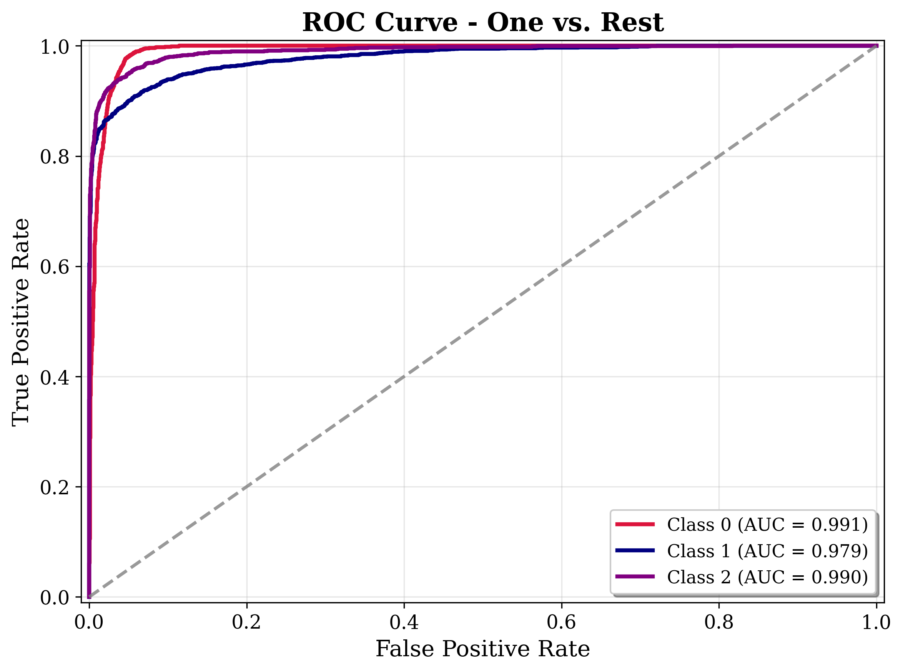

# **Common task**

## **1. Setup**
Run the following commands to clone the repo in local system and, for setting up the environment.
```bash
git clone https://github.com/suriya030/Evaluation-test.git
cd .\Evaluation-test\Common-Task
conda create -n common-task 
conda activate common-task
pip install -r requirements.txt
```
**NOTE** : Compatible versions of CUDA toolkit and CuDNN should be downloaded for GPU support. 

## **2. Usage**
```common-task.ipynb``` contains all the necessary scripts for training, and inference. Notebook is organised into multiple SECTIONS as given below:

<p align="center">
  
</p>

- For **training and inference** (from scratch): Run **SECTIONS 1, 2, 3, 4 and 5** (Refer above figure).

## 3. **Dataset and Model**

The dataset contains three classes of strong lensing images: **no substructure**, **subhalo substructure**, and **vortex substructure**, with **30,000 train** and **7,500 test** samples — each class contributing **10,000 train + 2,500 test**. Images are min-max normalized to **[0, 1]**.

**Split:** 25,500 train / 4,500 val / 7,500 test.

We use a **pre-trained ResNet-18** with a **custom head**, inspired by its success in [this study](https://arxiv.org/abs/2008.12731).


## 4. **Results** 

Below is the ROC curve ,

<p align="center">
  
</p>

**Classification Summary**

| Metric     | Class 0 (*no substructure*) | Class 1 (*subhalo*) | Class 2 (*vortex*) | Macro Avg |
|------------|-----------------------------|----------------------|--------------------|------------|
| **AUC**    | 0.990                       | 0.978               | 0.990             | 0.986      |

**Top-1 Accuracy:** 92.51% ( Test set )


## **5. Discussion**


