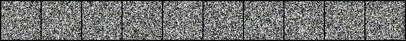

### **1. Setup**

Run the following commands to clone the repo and, setting up environment in local system.

```bash
git clone https://github.com/suriya030/Evaluation-test.git
cd .\Evaluation-test\Task-IV
conda create -n ddpm-pytorch python=3.8
conda activate ddpm-pytorch
pip install -r requirements.txt
```
**NOTE** : Compatible versions of CUDA toolkit and CuDNN should be downloaded for GPU support. 

---

### **2. Usage**

- For **training** (from scratch): Run ```ddpm-training.ipynb```.  
  **Note**: Download the folder named 'dataset' from the [🚨drive🚨]() and place it at ```\Evaluation-test\Task-IV```.
    
- For **generating new samples**: Run ```ddpm-generate-images.ipynb```.  
  **Note**: Trained DDPM model Checkpoint should be present at `.\Evaluation-test\Task-IV\default\`, by default I have included my trained DDPM model checkpoint there `ddpm_ckpt.pth`.
    
- For **FID score calculation**: Run ```ddpm-fid-calculation.ipynb``` 
  **Note**: Trained DDPM model Checkpoint should be present at `.\Evaluation-test\Task-IV\default\`, by default I have included my trained DDPM model checkpoint there `ddpm_ckpt.pth`. Also, download the folder named 'generated_images' from the [🚨drive🚨]() and place it at `.\Evaluation-test\Task-IV\default\`.

---

### **3. Dataset and model implimentation**

We have got 10,000 gravitational lensing images for developing DDPM model. we have split the datset into 90-10 train-test split. For more details refer the notebooks.

---

### **4. Results**

Below is the visualization illustrating image generation from noise, spanning timesteps from **1000 down to 1**:

<p align="center">
  
</p>

### Real vs. Generated Images Comparison

The following image presents a visual comparison between real images and those generated using the DDPM model:

<p align="center">
  
</p>

---

### Fréchet Inception Distance (FID) Scores

To evaluate image quality, we generated **10,000 images** and compared them against:

- **Train dataset** (9,000 images)
- **Test dataset** (1,000 images)


| Model | Dataset Comparison | FID Score ↓ |
|-------|--------------------|-------------|
| **DDPM** | Train vs. Generated | <span style="color: green;"><strong>10.53</strong></span> |
| **DDPM** | Test vs. Generated | <span style="color: green;"><strong>11.65</strong></span> |


## **5. Discussion**


