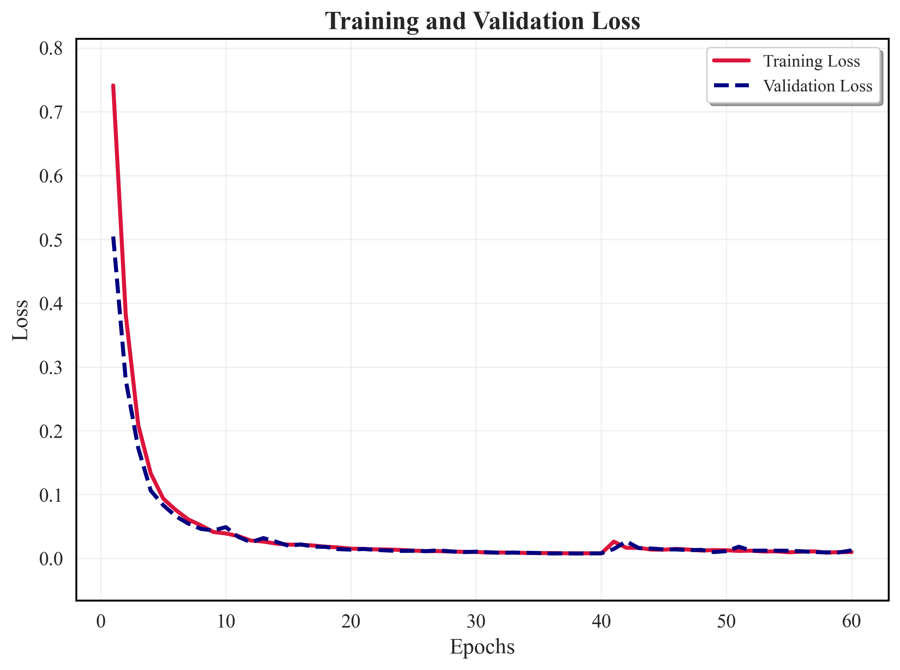
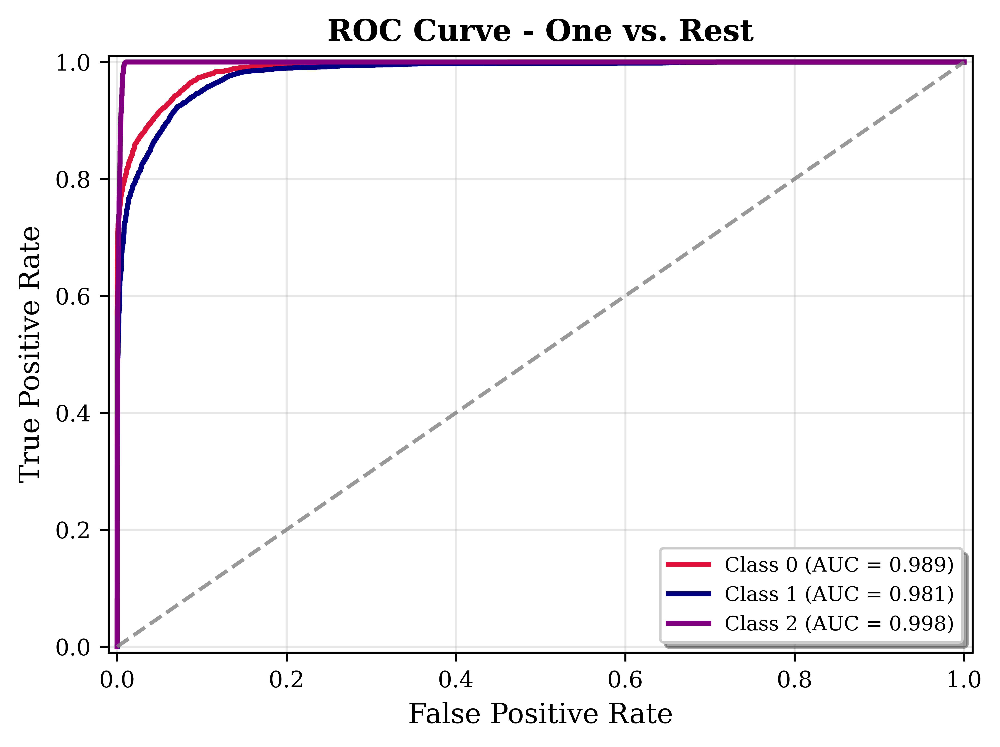

### **1. Setup**

Run the following commands to clone the repo and, set up environment in your local system. Assuming you have already have miniconda / anaconda setup. 

```bash
git clone https://github.com/suriya030/Evaluation-test.git
cd .\Evaluation-test\Task-VI
conda create -n mae-pytorch python=3.12
conda activate mae-pytorch
pip install -r requirements.txt
```
**NOTE** : Compatible versions of CUDA toolkit and CuDNN should be downloaded for GPU support. 

--- 

### **2. Usage**

#### Pre-training MAE
 - ```mae-pretrain.ipynb``` contains the necessary scripts for pre-training MAE ( from scratch ). 
  **Note** : Download the folder named ```dataset``` from the [🚨drive🚨](), and place it at the location ```.\Evaluation-test\Task-VI\.``` .


#### Finetuning MAE for classification
 - ```Task-VIA\mae-finetune-VIA.ipynb``` conatains the necessary scripts for finetuning MAE for classification on dark matter sub-structure . 
 **Note** : Download the folders named ```dataset``` and ```saved_models``` from the [🚨drive🚨](), and place both of them at location ```.\Evaluation-test\Task-VI\Task-VIA\.``` .

#### Finetuning MAE for Super-Resolution
 - ```Task-VIB\mae-finetune-VIB.ipynb``` conatains the necessary scripts for finetuning MAE for super-resolution. 
 **Note** : Download the folders named ```dataset``` and ```saved_models``` from, the [🚨drive🚨](), and place both of them at location ```.\Evaluation-test\Task-VI\Task-VIB\.``` .

---

### **3. Dataset and Implementation**
- For Pre-training MAE we have used 80-20 train-validation split of no substructure images .
- For Finetuning MAE-Encoder for classification of dark-matter substructure we used train-val-test split of 70-10-20.
  
   

---

### **4. Results**


**Pre-training Results**

The loss curve obtained during the MAE pre-training and the linear probing accuracy, which evaluates the learned representations, are shown below:

<div style="text-align: center;">
  
</div>

Below is a comparison showcasing how our model reconstructs an image using its learned representations. The original image is on the left, the masked original image is in the center, and the reconstructed version by our model is on the right.

<div style="text-align: center;">
  
</div>

---

**Finetuning Pre-trained MAE-encoder for classifiation**

We achieved a **Top-1 Test Accuracy of 92.61%** ( Train-Validation-Test split 70-10-20 ) . Below are the ROC curve and the training-validation accuracy curves:

<div style="display: flex; justify-content: center; gap: 20px;">
  
  
</div>

---

**Finetuning Pre-trained MAE-encoder for super resolution**

---

### **5. Discussion**


